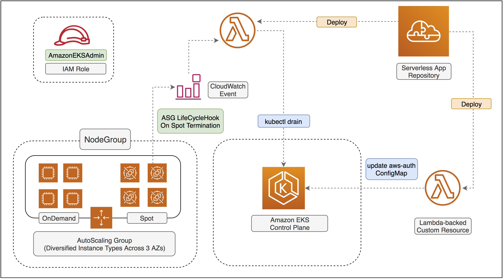
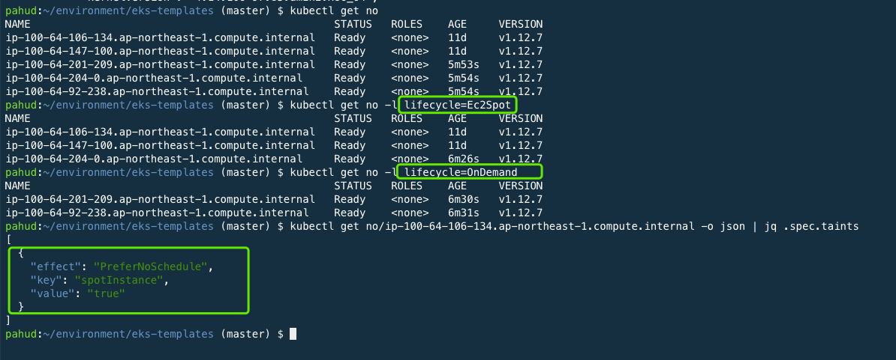

# eks-templates


#### Amazon EKS cloudformation templates

**pahud/eks-templates** aims to help you provision a ready-to-use Amazon EKS cluster by simply launching a cloudformation template with nested stacks. Supper easy and hassel-free!



## Features

- [x] Creates both Amazon EKS `cluster` and `NodeGroup` in a single cloudformatoin template with nested stacks.
- [x] Abstracts away the CLI control in the `Makefile` - simply `make create-eks-cluster`, `make update-eks-cluster` and `make delete-eks-cluster`. That's all.
- [x] Fully support the latest Autoscaling Group features to hybrid on-demand and spot instances with mixed types and purchase options.
- [x] The cloudformation stack will help you automate the configuration on `aws-auth-cm` **ConfigMap** with AWS Lambda-backed `custom resource`.
- [x] No need to provision SpotFleet anymore.
- [x] On-demand instances will have node label **lifecycle=OnDemand**
- [x] Spot instances will have node label **lifecycle=Ec2Spot** and a **spotInstance=true:PreferNoSchedule** taint
- [x] Support private subnets
- [x] Support non-RFC1918 IP/CIDR VPC subnets
- [x] Select the latest EKS-optimized AMI for Amazon Linux from a Lambda-backed cloudformaiton custom resource. This help you always use the latest EKS-Optimized AMI.
- [x] Support `pahud/eks-lambda-drainer` to help you `drain` the pods on terminating spot instances to protect your online workload.


## HOWTO

Create a `AmazonEKSAdminRole` IAM Role manually and we will use thie role to 
1) deploy the cloudformaiton stacks
2) execute the Lambda function as custom resource to help you configure the `aws-auth` ConfigMap so the nodes in the nodegroup can register themselves to the control plane.
3) `kubecl` will call Amazon EKS control plane as this IAM role for RBAC Auth.


```bash
$ aws iam create-role --role-name AmazonEKSAdminRole --assume-role-policy-document file://assume-role-policy.json
$ aws iam attach-role-policy --role-name AmazonEKSAdminRole --policy-arn arn:aws:iam::aws:policy/AmazonEC2FullAccess
$ aws iam attach-role-policy --role-name AmazonEKSAdminRole --policy-arn arn:aws:iam::aws:policy/service-role/AWSLambdaBasicExecutionRole
$ aws iam put-role-policy --role-name AmazonEKSAdminRole --policy-name EKSAdminExtraPolicies --policy-document file://eks-admin-iam-policy.json
```
get the role arn string. We will use the arn later.

```bash
$ aws iam get-role --role-name AmazonEKSAdminRole --query 'Role.Arn' --output text
arn:aws:iam::903779448426:role/AmazonEKSAdminRole
```

You **MUST** update `Makefile` and configure the following variables:

**CLUSTER_STACK_NAME** - the stack name and cluster name. default: `eksdemo`

**EKS_ADMIN_ROLE** - The `AmazonEKSAdminRole` arn described above.

**REGION** - The region code to deploy your EKS cluster. default: `ap-northeast-1`

**SSH_KEY_NAME** - Your existing SSH keypair name in AWS EC2 console. default: `aws-pahud` (please update this value)

**VPC_ID** - The VPC ID to deploy your nodegroup

**SUBNET1** The 1st subnet ID to deploy your nodegroup

**SUBNET2** The 2nd subnet ID to deploy your nodegroup

**SUBNET3** The 3rd subnet ID to deploy your nodegroup

Optionally, you can leave the `Makefile` untouched, and create a `custom.mk` file as your configuration file like this:


```
CLUSTER_STACK_NAME ?= eksdemo
SSH_KEY_NAME ?= 'aws-pahud'
EKS_ADMIN_ROLE ?= arn:aws:iam::903779448426:role/AmazonEKSAdminRole
REGION ?= us-west-2 
VPC_ID ?= vpc-c7635ea0 
SUBNET1 ?= subnet-0f247a2b289129708
SUBNET2 ?= subnet-0da5823de42ae81f9
SUBNET3 ?= subnet-02858661648d4840a
InstanceTypesOverride ?= 't3.medium,m4.large,m5.large'
OnDemandBaseCapacity ?= 2
NodeAutoScalingGroupMinSize ?= 10 
NodeAutoScalingGroupDesiredSize ?= 12
NodeAutoScalingGroupMaxSize ?= 20
```
The parameters in `custom.mk` file will override the content of `Makefile` for customization.


OK. Let's create the complete Amazon EKS cluster and nodegroup

```bash
$ make create-eks-cluster
```
You may override the default values like this
```bash
$ REGION=ap-northeast-1 EKS_ADMIN_ROLE=arn:aws:iam::903779448426:role/AmazonEKSAdminRole CLUSTER_STACK_NAME=eksdemo10 make create-eks-cluster
```
or if you intend to run your nodegroup in private subnets and disable the `auto-assign-public-ip` completely for your nodes.

```bash
$ ASGAutoAssignPublicIp=no make create-eks-cluster
```

To specify a specific Amazon EKS cluster version(`1.10`, `1.11` or `1.12`):

```bash
$ ClusterVersion=1.12 make create-eks-cluster    
```
(if you don't specify `ClusterVersion`, it will create the latest version for you)


response
```
{
    "StackId": "arn:aws:cloudformation:ap-northeast-1:903779448426:stack/eksdemo10/b3ebf5c0-3395-11e9-bfb3-0a4b1943673a"
}
```


Behind the scene, a cloudformation stack with `5` nested stacks will be created:

1. **eksdemo** - the primary stack containing 5 nested stacks
2. **eksdemo-CL-** - the control plane and security group
3. **eksdemo-AMI-** - EKS-Optimized AMI info for Amazon EKS
3. **eksdemo-NG-** - the nodegroup
4. **eksdemo-CM-** - the custom resource to update the `aws-auth` ConfigMap
5. **eksdemo-CM-xxx-** - the custom resource lambda function as `AWS::Serverless::Application` resource from `SAR(Serverless Application Repository)`


# Test and Validate

Now cloudformation stack is created. The Amazon EKS cluster will only be able to administratered via `kubectl` as `AmazonEKSAdminRole` IAM role. However, according to our 
[assume-role-policy.json](./assume-role-policy.json), only the following identities are allowed to assume to this role:

1. **Lambda service**(`lambda.amazonaws.com`)
2. **Cloudformation service**(`cloudformation.amazonaws.com`)

We need to grant our current IAM identity to assume this role(i.e. `AmazonEKSAdminRole`)

Let's check our current identity
```bash
$ aws sts get-caller-identity
{
    "Account": "903779448426", 
    "UserId": "AIDAJQENSMB5TSS54VEB2", 
    "Arn": "arn:aws:iam::903779448426:user/pahud"
}
```
(please note your `Account` and `Arn` string would be different from mine)

Let's edit `assume-role-policy.json` file from the local repo:

```json
{
  "Version": "2012-10-17",
  "Statement": [
    {
      "Effect": "Allow",
      "Principal": {
        "Service": "lambda.amazonaws.com"
      },
      "Action": "sts:AssumeRole"
    },
    {
      "Sid": "",
      "Effect": "Allow",
      "Principal": {
        "Service": "cloudformation.amazonaws.com"
      },
      "Action": "sts:AssumeRole"
    },
    {
      "Effect": "Allow",
      "Principal": {
        "AWS": "arn:aws:iam::903779448426:root"
      },
      "Action": "sts:AssumeRole"
    }
  ]
}

```

This will allow all IAM `user` from AWS Account ID `903779448426` be able to assume this role. 

If you prefer to restrict to a single IAM user, for example `pahud`:

```
"Principal": {
    "AWS": "arn:aws:iam::903779448426:user/pahud"
}
```

And of course you can specify multiple IAM users in `Principal` 
```
"Principal": {
    "AWS": "arn:aws:iam::903779448426:user/pahud",
    "AWS": "arn:aws:iam::903779448426:user/emilie"
}
```

OK let's update the assume role policy

```bash
$ aws iam update-assume-role-policy --role-name AmazonEKSAdminRole --policy-document file://assume-role-policy.json
```

Try assume this role with `aws assume-role` like this

```bash
$ aws sts assume-role --role-arn arn:aws:iam::903779448426:role/AmazonEKSAdminRole --role-session-name test
{
    "AssumedRoleUser": {
        "AssumedRoleId": "AROAJCL4US4TE3MXZM272:test", 
        "Arn": "arn:aws:sts::903779448426:assumed-role/AmazonEKSAdminRole/test"
    }, 
    "Credentials": {
        "SecretAccessKey": "...", 
        "SessionToken": "...", 
        "Expiration": "2019-02-20T08:19:58Z", 
        "AccessKeyId": "..."
    }
}

```

If you get the response like this then you are allowed to assume role to `AmazonEKSAdminRole`.


# download required binaries

download the latest `kubectl` binary

For example, in Linux

```bash
$ curl https://amazon-eks.s3-us-west-2.amazonaws.com/1.12.7/2019-03-27/bin/linux/amd64/kubectl -o kubectl
$ chmod +x $_
$ sudo mv $_ /usr/local/bin/
```
check Amazon EKS document about [install kubectl](https://docs.aws.amazon.com/eks/latest/userguide/install-kubectl.html#install-kubectl-linux) and [getting started](https://docs.aws.amazon.com/eks/latest/userguide/getting-started.html) and 
download the two binaries of latest version.

# generate or update kubeconfig

run `update-kubeconfig` 

```bash
$ aws --region ap-northeast-1 eks update-kubeconfig --name eksdemo --role-arn arn:aws:iam::903779448426:role/AmazonEKSAdminRole
```
response
```
Updated context arn:aws:eks:ap-southeast-1:903779448426:cluster/eksdemo in /home/ec2-user/.kube/config
```

try list the nodes

```bash
$ kubectl get no
NAME                                                STATUS   ROLES    AGE   VERSION
ip-100-64-106-134.ap-northeast-1.compute.internal   Ready    <none>   11d   v1.12.7
ip-100-64-147-100.ap-northeast-1.compute.internal   Ready    <none>   11d   v1.12.7
```

Your cluster is ready now.


# update the cluster 

update from `1.10` to `1.11`
```bash
$ ClusterVersion=1.11 make update-eks-cluster
```
update from `1.11` to `1.12`
```bash
$ ClusterVersion=1.12 make update-eks-cluster
```


## Node Labels, Taints and Tolerations

By default, all the on-demand instances will have **lifecycle=OnDemand** label while spot instances will have **lifecycle=Ec2Spot**. Use the node selector to better schedule your workload




Additionally, all the spot instances have a **spotInstance=true:PreferNoSchedule** taint. To deploy your Pod on spot instances, use the node label selector to specify **lifecycle=Ec2Spot**, otherwise the pod will not be scheduled on the spot instances unless it has relevant toleration. ([Taint and Toleration in Kubernetes](https://kubernetes.io/docs/concepts/configuration/taint-and-toleration/)).


# Spot Termination Handling

To enable the [**pahud/eks-lambda-drainer**](https://github.com/pahud/eks-lambda-drainer) support as the plug-in and install the drainer from SAR, 
just pass `EnableNodeDrainer=yes` to the `make` command. e.g.

```bash
$ EnableNodeDrainer=yes make create-eks-cluster
```
A `Drainer` cloudformation nested stack will be created and install the `eks-lambda-drainer` from SAR for you. All the 
spot instance termination will be watched and handled by the provided Lambda function. Easy peasy! 
